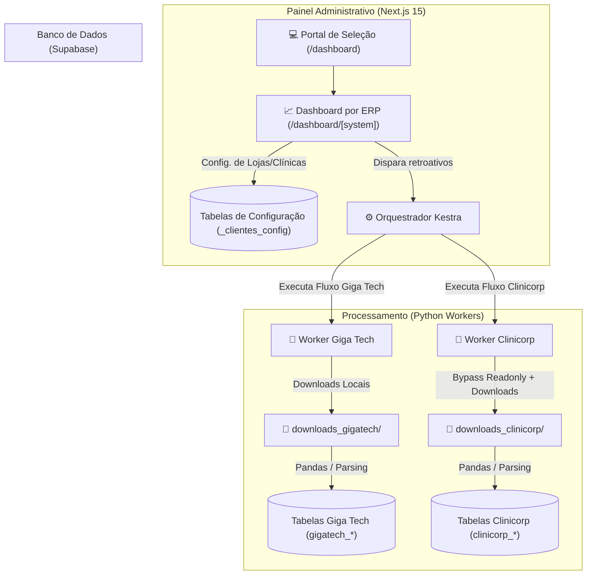

# 🚀 Plataforma de Automação Multi-Sistemas (V2.1)

Sistema robusto de automação de relatórios, orquestração e gerenciamento de múltiplos clientes (Multi-tenant). O projeto evoluiu para uma plataforma genérica que gerencia e monitora múltiplos fluxos de sincronização, integrando atualmente o ERP **Giga Tech** e o sistema odontológico **Clinicorp**. 

A infraestrutura é composta por processadores de dados em **Python**, banco de dados **Supabase**, agendadores automatizados no **Kestra** e um **Dashboard Web** administrativo construído em **Next.js 15**.

---

## 🗺️ Mapa de Arquitetura e Fluxo de Dados

Abaixo está ilustrado como os dados trafegam pelo ecossistema de forma dinâmica para múltiplos ERPs:



---

## 📁 Estrutura do Projeto

```
├── worker_gigatech/           # 🐍 Automação e Processamento (Giga Tech)
│   ├── main.py                # Orquestrador do robô da Giga Tech
│   ├── scraper.py             # Playwright para login e download de relatórios
│   ├── processor.py           # Parsing de XLS/PDF via Pandas
│   ├── database.py            # Operações no Supabase e idempotência
│   └── tmp_downloads/
│
├── worker_clinicorp/          # 🐍 [NOVO] Automação e Processamento (Clinicorp)
│   ├── main.py                # Orquestrador do robô da Clinicorp
│   ├── scraper.py             # Playwright (Bypass de datas readonly via JS)
│   ├── processor.py           # Parsing de XLS e regras de faturamento/valores
│   ├── database.py            # Conexão, batch insert e idempotência
│   └── tmp_downloads/
│
├── web/                       # 🌐 Dashboard Administrativo Unificado (Next.js 15)
│   ├── src/
│   │   ├── app/
│   │   │   ├── dashboard/
│   │   │   │   ├── page.tsx   # Portal central de seleção de sistemas
│   │   │   │   └── [system]/  # Dashboard, logs e CRUD dinâmicos por ERP
│   │   │   └── login/
│   │   ├── components/        # Componentes genéricos de CRUD e Console
│   │   └── utils/
│   │       ├── systems.ts     # Configuração e mapeamento estático de ERPs
│   │       └── kestra.ts      # Conexão com API do Kestra e logs em tempo real
│   └── package.json
│
├── gigatech_orchestrator.yaml # ⚙️ Fluxo Kestra da Giga Tech
├── clinicorp_orchestrator.yaml# ⚙️ [NOVO] Fluxo Kestra da Clinicorp
├── requirements.txt           # Dependências do ambiente Python
└── agent.md                   # Histórico de desenvolvimento do agente
```

---

## 🛠️ Configuração e Instalação

### 1. Requisitos
* **Python 3.10+** (Recomendado `.venv`)
* **Node.js 18+**
* Projeto no **Supabase** ativo com as tabelas criadas.

### 2. Variáveis de Ambiente (`.env`)
Copie o arquivo `.env.example` e crie um arquivo `.env` na raiz do projeto (e também em `web/.env.local` para o Next.js):

```env
# Conexão Supabase
SUPABASE_URL="sua-url-do-supabase"
SUPABASE_KEY="sua-chave-anon-ou-service-role"

# Webhook do Kestra (Necessário para a interface disparar retroativos)
KESTRA_WEBHOOK_URL="sua-url-do-webhook-kestra"

# Autenticação do Kestra (Preencha uma delas se aplicável)
KESTRA_BASIC_AUTH="usuario:senha"
KESTRA_API_TOKEN=""
```

---

## 🚀 Como Executar

### 🐍 Rodando os Workers Python (Automação)

1. Crie e ative o ambiente virtual:
   ```bash
   python -m venv .venv
   .venv\Scripts\activate      # Windows
   source .venv/bin/activate    # Linux/macOS
   ```
2. Instale as dependências:
   ```bash
   pip install -r requirements.txt
   playwright install chromium
   ```
3. Execute o robô correspondente:
   * **Giga Tech (Geral - Ontem D-1):**
     ```bash
     python -m worker_gigatech.main
     ```
   * **Clinicorp (Geral - Hoje D-0):**
     ```bash
     python -m worker_clinicorp.main
     ```
   * **Execução Retroativa Individual (Exemplo Clinicorp):**
     ```powershell
     # No Windows (PowerShell)
     $env:KESTRA_CLIENTE_ID="uuid-do-cliente"
     $env:KESTRA_DATA_INICIAL="01/06/2026"
     $env:KESTRA_DATA_FINAL="21/06/2026"
     python -m worker_clinicorp.main
     ```

### 💻 Rodando o Dashboard Web (Interface)

1. Acesse o diretório frontend:
   ```bash
   cd web
   ```
2. Instale as dependências:
   ```bash
   npm install
   ```
3. Inicie o servidor de desenvolvimento:
   ```bash
   npm run dev
   ```
4. Acesse em seu navegador: [http://localhost:3000](http://localhost:3000)

---

## 🗄️ Tabelas do Supabase (Modelo de Dados)

### Tabelas Giga Tech
| Tabela | Função |
| :--- | :--- |
| **`gigatech_clientes_config`** | Credenciais & Status dos clientes Giga |
| **`gigatech_vendas`** | Relatório de Vendas Detalhadas |
| **`gigatech_vendedores`** | Relatório de Vendedores vinculados |
| **`gigatech_clientes_novos`**| Clientes Novos Cadastrados no período |
| **`gigatech_estoque`** | Custo e Quantidade de Estoque |

### Tabelas Clinicorp
| Tabela | Função |
| :--- | :--- |
| **`clinicorp_clientes_config`** | Credenciais & Status das Clínicas |
| **`clinicorp_faturamento_profissional`** | Resumo de faturamento por dentista/profissional |
| **`clinicorp_orcamentos`** | Listagem detalhada de orçamentos e procedimentos |
| **`clinicorp_primeiras_consultas`** | Agendamentos de novos pacientes captados |
