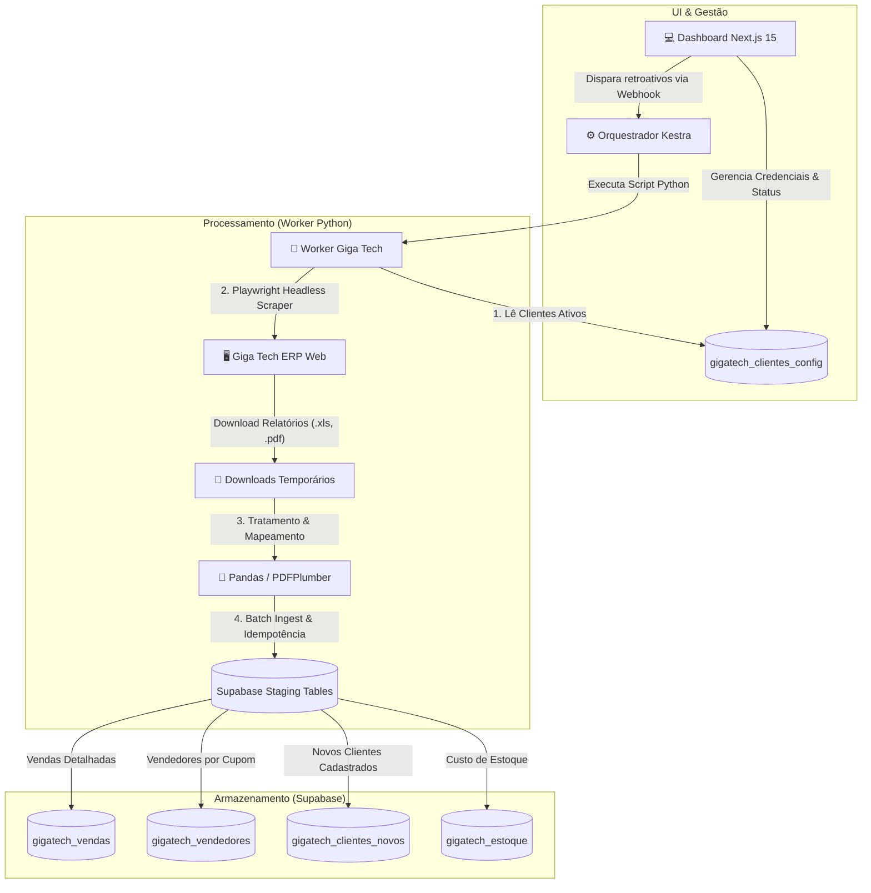

# 🚀 Giga Tech Multi-tenant (V2.0)

Sistema robusto de automação de relatórios, orquestração e gerenciamento de múltiplos clientes (Multi-tenant). O projeto integra o ERP **Giga Tech**, processamento de dados em **Python**, banco de dados **Supabase**, agendamento automatizado no **Kestra** e um **Dashboard Web** administrativo construído em **Next.js 15**.

---

## 🗺️ Mapa de Arquitetura e Fluxo de Dados

Abaixo está ilustrado como os dados trafegam pelo ecossistema, desde o agendamento no Kestra ou ação na UI até a gravação final otimizada no banco de dados.



---

## 💎 Principais Características

> [!TIP]
> **Fim do Supabase Storage**: A arquitetura 2.0 elimina totalmente o uso de Buckets. Os relatórios baixados pelo Playwright são processados diretamente na memória do container local e inseridos no banco.

* **Multi-tenant Nativo**: Suporte para ilimitados clientes na mesma estrutura. Todos os dados brutos possuem vinculação com a chave `cliente_id` associada à tabela `gigatech_clientes_config`.
* **Idempotência Garantida**: A re-execução do fluxo para qualquer período retroativo é 100% segura. O script executa o método `clean_period_data()` limpando os dados preexistentes daquele intervalo de datas antes de inserir o novo bloco.
* **Resiliência de Layouts**: O processador de dados mapeia e suporta variações dinâmicas de colunas feitas pelo ERP (como `EAN`, `Cod.Barra`, `Cód Barra`).
* **Kestra Integration (D-1 Automático)**: Caso execute no agendador diário sem parâmetros explícitos, o worker calcula e processa as informações retroativas de ontem (D-1) automaticamente.
* **Painel Administrativo Premium**: Interface web moderna que centraliza o controle de credenciais dos clientes, exibição das últimas execuções de logs e modal flutuante para disparo retroativo individual.

---

## 📁 Estrutura do Projeto

O repositório é composto por dois ecossistemas principais:

```
├── worker_gigatech/           # 🐍 Automação e Processamento (Python)
│   ├── main.py                # Orquestrador local, loop de clientes e fluxo D-1
│   ├── scraper.py             # Automação Playwright para login e download de relatórios
│   ├── processor.py           # Tratamento, limpeza e parsing de XLS/PDF via Pandas
│   ├── database.py            # Operações no Supabase, insert em batch e idempotência
│   └── tmp_downloads/         # Diretório temporário para arquivos locais
│
├── web/                       # 🌐 Dashboard Administrativo (Next.js 15)
│   ├── src/
│   │   ├── app/               # Roteamento e telas (Dashboard, Clientes, Logs)
│   │   ├── components/        # Componentes UI (Tabelas, Sidebar, Modais)
│   │   └── utils/             # Conexão e integração com Supabase Client/Server
│   └── package.json
│
├── gigatech_orchestrator.yaml # ⚙️ Definição da orquestração no Kestra
├── requirements.txt           # Dependências do ambiente Python
└── agent.md                   # Histórico de desenvolvimento e documentação técnica do agente
```

---

## 🛠️ Configuração e Instalação

### 1. Requisitos Pró-ativos
* **Python 3.10+** (Recomendado `.venv`)
* **Node.js 18+**
* Projeto no **Supabase** ativo com as tabelas `gigatech_*` criadas.

### 2. Configurando as Variáveis de Ambiente (`.env`)
Copie o arquivo `.env.example` e crie um arquivo `.env` na raiz do projeto (e também em `web/.env.local` para a interface Next.js):

```env
# Conexão Supabase
SUPABASE_URL="sua-url-do-supabase"
SUPABASE_KEY="seu-token-key-do-supabase"

# Webhook do Kestra (para disparos retroativos)
KESTRA_WEBHOOK_URL="sua-url-do-webhook-kestra"
```

---

## 🚀 Como Executar

### 🐍 Rodando o Worker Python (Automação)

1. Crie e ative o ambiente virtual:
   ```bash
   python -m venv .venv
   .venv\Scripts\activate      # Windows
   source .venv/bin/activate    # Linux/macOS
   ```
2. Instale as dependências:
   ```bash
   pip install -r requirements.txt
   playwright install chromium
   ```
3. Execute o robô:
   * **Execução Geral (Todos os clientes ativos - Ontem D-1):**
     ```bash
     python -m worker_gigatech.main
     ```
   * **Execução Retroativa Individual (Passando parâmetros):**
     ```bash
     $env:KESTRA_CLIENTE_ID="uuid-do-cliente"
     $env:DATA_INICIAL="2026-06-01"
     $env:DATA_FINAL="2026-06-15"
     python -m worker_gigatech.main
     ```

### 💻 Rodando o Dashboard Web (Interface)

1. Acesse o diretório frontend:
   ```bash
   cd web
   ```
2. Instale as dependências NPM:
   ```bash
   npm install
   ```
3. Inicie o servidor de desenvolvimento:
   ```bash
   npm run dev
   ```
4. Acesse em seu navegador: [http://localhost:3000](http://localhost:3000)

---

## 🗄️ Tabelas do Supabase (Modelo de Dados)

> [!IMPORTANT]
> Todas as tabelas de dados brutos estão indexadas nas colunas `cliente_id` e `data_venda` (ou `data_cadastro`) para consultas velozes no Dashboard.

| Tabela | Função | Colunas Principais |
| :--- | :--- | :--- |
| **`gigatech_clientes_config`** | Configurações & Login | `id` (UUID), `nome_loja`, `email_login_giga`, `senha_login_giga`, `ativo` (Bool) |
| **`gigatech_vendas`** | Relatório de Vendas | `cliente_id` (FK), `data_venda`, `n_cupom`, `produto`, `ean`, `quantidade`, `valor_venda` |
| **`gigatech_vendedores`** | Vendedores vinculados | `cliente_id` (FK), `data_venda`, `n_cupom`, `nome_vendedor`, `nome_cliente` |
| **`gigatech_clientes_novos`**| Clientes Novos | `cliente_id` (FK), `nome_cliente`, `data_cadastro` |
| **`gigatech_estoque`** | Custo e Quantidade | `cliente_id` (FK), `ean`, `produto`, `quantidade`, `valor_venda`, `custo` |
