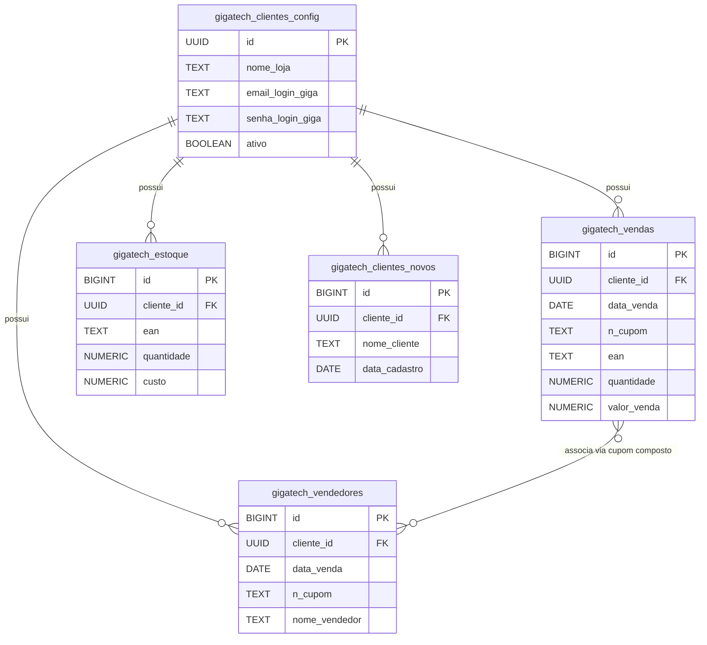

# 🗄️ Estrutura do Banco de Dados: Giga Tech Multi-tenant

Este documento descreve a modelagem das tabelas do banco de dados no Supabase (projeto `ProjectsGerais`) para a automação Giga Tech, incluindo tipos de dados, chaves e relacionamentos lógicos.

---

## 1. Dicionário de Tabelas

Todas as tabelas de dados brutos utilizam o prefixo `gigatech_` e possuem a coluna `cliente_id` como chave estrangeira (**Foreign Key**) obrigatória para isolar os dados por cliente.

### 🔑 Tabela Mestra (Configurações)

#### `gigatech_clientes_config`
Armazena os lojistas cadastrados, status de atividade e credenciais criptografadas para acesso ao ERP Giga Tech.

| Campo | Tipo | Restrições | Descrição |
| :--- | :--- | :--- | :--- |
| `id` | `UUID` | `PRIMARY KEY`, `DEFAULT gen_random_uuid()` | Identificador único do cliente no ecossistema. |
| `nome_loja` | `TEXT` | `NOT NULL` | Nome fantasia ou razão social da loja. |
| `email_login_giga` | `TEXT` | `NOT NULL`, `UNIQUE` | E-mail de autenticação no sistema Giga Tech. |
| `senha_login_giga` | `TEXT` | `NOT NULL` | Senha de autenticação no sistema Giga Tech. |
| `ativo` | `BOOLEAN` | `DEFAULT true` | Controla se o robô deve processar esta loja nas rotinas horárias. |
| `created_at` | `TIMESTAMPTZ` | `DEFAULT now()` | Data e hora de criação do registro. |

---

### 📊 Tabelas de Dados Brutos (Staging)

Tabelas populadas em lote pelo robô orquestrador após a extração e tratamento dos arquivos locais.

#### `gigatech_vendas`
Armazena o detalhamento de itens vendidos extraídos do relatório Excel de Vendas Detalhadas.

| Campo | Tipo | Restrições | Descrição |
| :--- | :--- | :--- | :--- |
| `id` | `BIGINT` | `PRIMARY KEY`, `GENERATED ALWAYS AS IDENTITY` | Identificador único da linha. |
| `cliente_id` | `UUID` | `FOREIGN KEY` (➔ `gigatech_clientes_config.id`) | Vinculação com a tabela mestra. |
| `data_venda` | `DATE` | `NOT NULL` | Data em que a venda foi realizada. |
| `n_cupom` | `TEXT` | `NOT NULL` | Número do cupom/comprovante fiscal da venda. |
| `produto` | `TEXT` | `NOT NULL` | Descrição/Nome do produto vendido. |
| `ean` | `TEXT` | `NOT NULL` | Código de barras (EAN/GTIN) do produto. |
| `quantidade` | `NUMERIC` | `NOT NULL` | Quantidade vendida do item. |
| `valor_venda` | `NUMERIC` | `NOT NULL` | Valor bruto da venda do item. |
| `custo` | `NUMERIC` | `NOT NULL` | Custo do produto vendido (para cálculo de margem). |
| `margem` | `NUMERIC` | `NOT NULL` | Margem de lucro calculada para o item. |

#### `gigatech_vendedores`
Armazena a relação de vendas por vendedor extraídas do relatório em formato PDF.

| Campo | Tipo | Restrições | Descrição |
| :--- | :--- | :--- | :--- |
| `id` | `BIGINT` | `PRIMARY KEY`, `GENERATED ALWAYS AS IDENTITY` | Identificador único da linha. |
| `cliente_id` | `UUID` | `FOREIGN KEY` (➔ `gigatech_clientes_config.id`) | Vinculação com a tabela mestra. |
| `data_venda` | `DATE` | `NOT NULL` | Data da venda vinculada. |
| `n_cupom` | `TEXT` | `NOT NULL` | Número do cupom fiscal. |
| `nome_vendedor` | `TEXT` | `NOT NULL` | Nome completo do vendedor cadastrado no ERP. |
| `nome_cliente` | `TEXT` | - | Nome do cliente comprador final (opcional). |

#### `gigatech_estoque`
Armazena a foto atual de quantidade e custo de estoque gerada pelo relatório Excel de Custo de Estoque.

| Campo | Tipo | Restrições | Descrição |
| :--- | :--- | :--- | :--- |
| `id` | `BIGINT` | `PRIMARY KEY`, `GENERATED ALWAYS AS IDENTITY` | Identificador único da linha. |
| `cliente_id` | `UUID` | `FOREIGN KEY` (➔ `gigatech_clientes_config.id`) | Vinculação com a tabela mestra. |
| `ean` | `TEXT` | `NOT NULL` | Código de barras do produto em estoque. |
| `produto` | `TEXT` | `NOT NULL` | Descrição do produto. |
| `quantidade` | `NUMERIC` | `NOT NULL` | Quantidade atual do produto em estoque físico. |
| `valor_venda` | `NUMERIC` | `NOT NULL` | Preço unitário praticado para venda. |
| `custo` | `NUMERIC` | `NOT NULL` | Custo médio de aquisição do produto. |

#### `gigatech_clientes_novos`
Armazena o registro de clientes cadastrados no período extraídos do relatório PDF.

| Campo | Tipo | Restrições | Descrição |
| :--- | :--- | :--- | :--- |
| `id` | `BIGINT` | `PRIMARY KEY`, `GENERATED ALWAYS AS IDENTITY` | Identificador único da linha. |
| `cliente_id` | `UUID` | `FOREIGN KEY` (➔ `gigatech_clientes_config.id`) | Vinculação com a tabela mestra. |
| `nome_cliente` | `TEXT` | `NOT NULL` | Nome completo do cliente cadastrado. |
| `data_cadastro` | `DATE` | `NOT NULL` | Data em que o cadastro do cliente foi efetuado. |

---

## 2. Diagrama de Relacionamento (MER)



---

## 3. Relacionamentos e Cruzamentos Lógicos

Para alimentar painéis de comissões, faturamento e performance do vendedor na interface, realizamos cruzamentos estratégicos entre as tabelas:

### A. Cruzamento Vendas + Vendedor
Como a tabela `gigatech_vendas` armazena os **itens vendidos** e a tabela `gigatech_vendedores` armazena o **vendedor responsável** por aquela venda, a junção é feita através de uma **Chave Composta Tríplice**:
1. `cliente_id` (Garante isolamento multi-tenant).
2. `data_venda` (Previne colisão de numeração de cupom em datas diferentes).
3. `n_cupom` (Código identificador da transação).

#### SQL de Exemplo (Criação de View)
```sql
SELECT 
    v.cliente_id,
    c.nome_loja,
    v.data_venda,
    v.n_cupom,
    v.produto,
    v.ean,
    v.quantidade,
    v.valor_venda,
    vd.nome_vendedor
FROM gigatech_vendas v
INNER JOIN gigatech_clientes_config c ON v.cliente_id = c.id
LEFT JOIN gigatech_vendedores vd ON 
    v.cliente_id = vd.cliente_id 
    AND v.data_venda = vd.data_venda 
    AND v.n_cupom = vd.n_cupom;
```

### B. Cruzamento Vendas + Estoque
Caso queira analisar a taxa de conversão, margens ou curva ABC de produtos de forma contextualizada com a disponibilidade física do item, a relação é feita usando:
1. `cliente_id`
2. `ean` (Código de barras do produto)

---

## ⚡ Índices de Performance Criados
Para otimizar os cruzamentos de dados volumosos em painéis BI de alta demanda, foram criados os seguintes índices combinados no banco de dados Supabase:
* `idx_gigatech_vendas_cliente_data` ➔ tabela `gigatech_vendas(cliente_id, data_venda)`
* `idx_gigatech_vendedores_cliente_data` ➔ tabela `gigatech_vendedores(cliente_id, data_venda)`
* `idx_gigatech_estoque_cliente_ean` ➔ tabela `gigatech_estoque(cliente_id, ean)`
